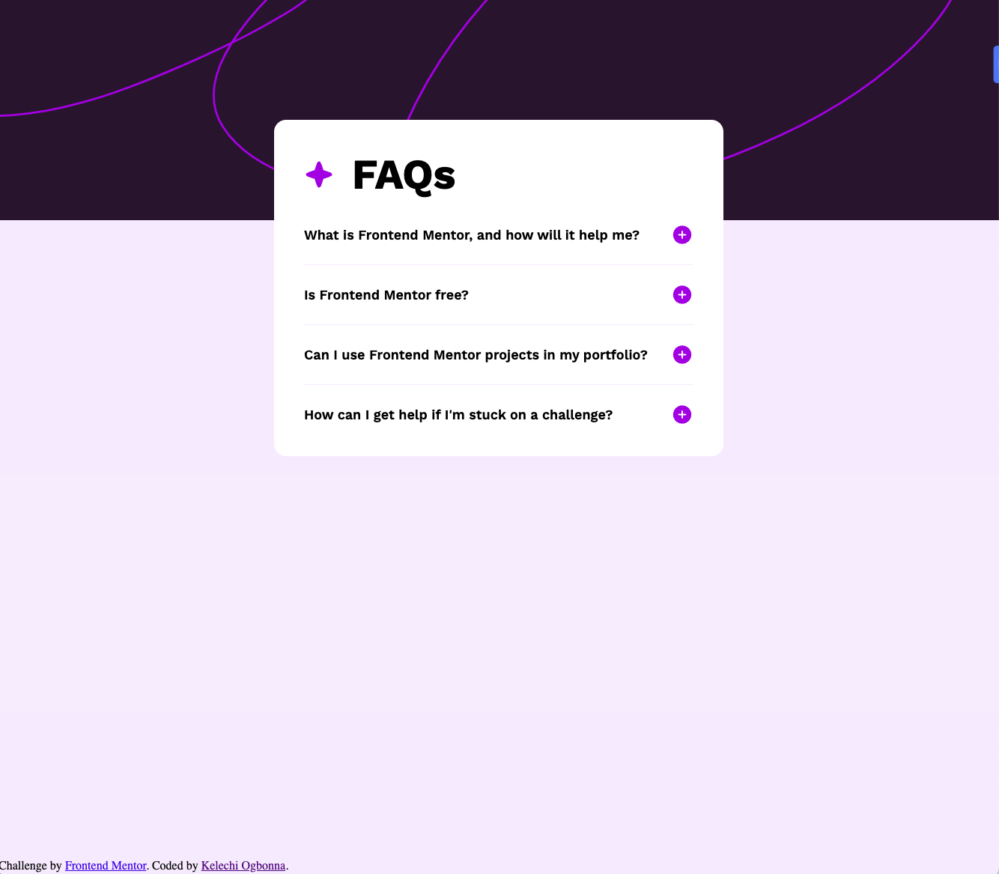

# Frontend Mentor - FAQ accordion solution

## Table of contents

- [Overview](#overview)
  - [The challenge](#the-challenge)
  - [Screenshot](#screenshot)
  - [Links](#links)
- [My process](#my-process)
  - [Built with](#built-with)
  - [Continued development](#continued-development)

## Overview

This is a solution to the [FAQ accordion challenge on Frontend Mentor](https://www.frontendmentor.io/challenges/faq-accordion-wyfFdeBwBz).

### The challenge

Users should be able to:

- Hide/Show the answer to a question when the question is clicked
- Navigate the questions and hide/show answers using keyboard navigation alone
- View the optimal layout for the interface depending on their device's screen size
- See hover and focus states for all interactive elements on the page

### Screenshot

### Links

- GitHub Solution URL: [github.com/Kellswork/faq-accordion](https://github.com/Kellswork/faq-accordion)
- Live Site URL: [kellswork.github.io/faq-accordion/](https://kellswork.github.io/faq-accordion/)

## My process

### Built with

- Semantic HTML5 markup
- CSS custom properties
- Flexbox
- Responsive design
- [React](https://reactjs.org/) - JS library

### Continued development

- Semantic HTML
- Accessibility
- Mobile First design
